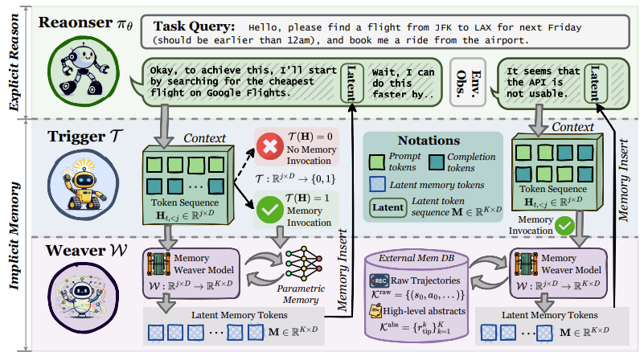

# MemGen: Weaving Generative Latent Memory for Self-Evolving Agents


## 👋 Introduction
This repo is the official implementation of [**[ICLR 2026] MemGen: Weaving Generative Latent Memory for Self-Evolving Agents**](https://arxiv.org/pdf/2509.24704).

Inspired by the human brain’s ability to dynamically integrate memory and reasoning, MemGen introduces a novel framework that empowers AI agents to evolve through experience—without relying on rigid parameter updates or external databases.

Unlike traditional approaches, MemGen generates latent memory tokens directly within the model’s reasoning stream. It features:
- A Memory Trigger that decides when to recall memory.
- A Memory Weaver that synthesizes past experiences into compact, latent sequences—seamlessly enriching ongoing reasoning.




## ❓ FAQ

#### Q1: Why does the code encounter issues when running on multiple GPUs?

**A:** DDP is supported, but FSDP is not currently supported. Thank you for your understanding.


#### Q2: Where is the multi-turn GRPO code (e.g., for AlfWorld and TriviaQA)?

**A:** We plan to release the MemGen-GRPO eval/train scripts and checkpoints after releasing those for MemGen-SFT. Thank you for your patience and understanding.


#### Q3: What improvements are included in the latest MemGen codebase?

**A:** In the previous version, single-turn training did not use the ChatML template (for both the baseline and MemGen), which led to lower performance. In addition, we identified a small but impactful formatting issue: for the 1.5B model, whether the prompt ends with `\boxed{}` followed by `.` or `\n` significantly affects performance. In particular, appending  `\n` after *“Put your answer within \boxed{}”* can noticeably degrade results compared with appending `.`. While surprising, this behavior was consistent in our tests. The updated codebase consistently applies the ChatML template across all datasets and resolves these formatting inconsistencies. We still observe stable performance gains from MemGen under this unified setup.

We apologize for any inconvenience caused by the earlier version.

## 🌎 Setup

Create and activate the MemGen environment:  
Option 1: Install via `requirements.txt`
```
conda create -n memgen python=3.10
conda activate memgen
pip install -r requirements.txt
```

Option 2: Install via `memgen.yml`
```
conda env create -f memgen.yml
conda activate memgen
```

Option 3: Set Up Search Environment  
Please follow the instructions in the [Search-R1](https://github.com/PeterGriffinJin/Search-R1?tab=readme-ov-file#retriever-environment-optional) to configure the retriever environment.

## 🤗 Quick Evaluation

Below are several MemGen models based on Qwen2.5-1.5B-Instruct and SmolLM3-3B across multiple datasets. We are currently in the process of carefully validating additional checkpoints to ensure they are fully reproducible and can be released in a clean, one-click setup. We appreciate your patience as we complete this verification process.

| model | dataset | mode | link | eval_script | train_script |
|-------|---------|------|------|-------------|--------------|
| Qwen2.5-1.5B-Instruct | KodCode | weaver-sft | [huggingface link](https://huggingface.co/Kana-s/MemGen/tree/main/Qwen2.5-1.5B-Instruct/kodcode/weaver-sft) | `scripts/eval/qwen2_5_kodcode_sft.sh` | `scripts/train/qwen2_5_kodcode_sft.sh` |
| Qwen2.5-1.5B-Instruct | KodCode | weaver-grpo | [huggingface link](https://huggingface.co/Kana-s/MemGen/tree/main/Qwen2.5-1.5B-Instruct/kodcode/weaver-grpo) | `scripts/eval/qwen2_5_kodcode_grpo.sh` | `scripts/train/qwen2_5_kodcode_grpo.sh` |
| Qwen2.5-1.5B-Instruct | GSM8K | weaver-sft | [huggingface link](https://huggingface.co/Kana-s/MemGen/tree/main/Qwen2.5-1.5B-Instruct/gsm8k/weaver-sft) | `scripts/eval/qwen2_5_gsm8k_sft.sh` | `scripts/train/qwen2_5_gsm8k_sft.sh` |
| Qwen2.5-1.5B-Instruct | GSM8K | weaver-grpo | [huggingface link](https://huggingface.co/Kana-s/MemGen/tree/main/Qwen2.5-1.5B-Instruct/gsm8k/weaver-grpo) | `scripts/eval/qwen2_5_gsm8k_grpo.sh` | `scripts/train/qwen2_5_gsm8k_grpo.sh` |
| Qwen2.5-1.5B-Instruct | TriviaQA | weaver-sft | [huggingface link](https://huggingface.co/Kana-s/MemGen/tree/main/Qwen2.5-1.5B-Instruct/triviaqa/weaver-sft) | `scripts/eval/qwen2_5_triviaqa.sh` | `scripts/train/qwen2_5_triviaqa.sh` |
| SmolLM3-3B | KodCode | weaver-sft | [huggingface link](https://huggingface.co/Kana-s/MemGen/tree/main/SmolLM3-3B/kodcode/weaver-sft) | `scripts/eval/smollm_kodcode.sh` | `scripts/train/smollm_kodcode.sh` |
| SmolLM3-3B | TriviaQA | weaver-sft | [huggingface link](https://huggingface.co/Kana-s/MemGen/tree/main/SmolLM3-3B/triviaqa/weaver-sft) | `scripts/eval/smollm_triviaqa.sh` | `scripts/train/smollm_triviaqa.sh` |


If you prefer to evaluate the vanilla model instead of MemGen, simply modify `memgen/model/modeling_memgen.py` by replacing the current `generate` function (Lines 452–629) with the commented alternative `generate` implementation (Lines 379–450), and then run the standard evaluation script.


## ▶️ How to Run
MemGen consists of **two modules**: *Weaver* and *Trigger*. We follow a two-stage training approach, training each module separately.

If you would like to reproduce results for a specific dataset + model, please refer to the table above. If the corresponding checkpoint is not yet available, we kindly ask for your patience as we are actively preparing more comprehensive releases.

### Weaver Model
- **Train the Weaver model**
    ```bash
    bash weaver_train.sh
    ```

- **Evaluate the Weaver model**  
    Before running, make sure to update `LOAD_MODEL_PATH` in `eval.sh` to point to the trained checkpoint: `<weaver_dir>`
    ```bash
    bash eval.sh
    ```

### Trigger Model
- **Train the Trigger model**
    ```bash
    bash trigger_train.sh
    ```
- **Evaluate the Trigger model**  
    Before running, make sure to update `LOAD_MODEL_PATH` in `eval.sh` to point to the trained checkpoint: `<trigger_dir>`
    ```bash
    bash eval.sh
    ```


## 🫡 Citation
If you find this repository helpful, a citation to our paper would be greatly appreciated:
```
@article{zhang2025memgen,
  title={MemGen: Weaving Generative Latent Memory for Self-Evolving Agents},
  author={Zhang, Guibin and Fu, Muxin and Yan, Shuicheng},
  journal={arXiv preprint arXiv:2509.24704},
  year={2025}
}
```

## 🙏 Acknowledgement
- We sincerely thank [Search-R1](https://github.com/PeterGriffinJin/Search-R1) for open-sourcing their search web environment.
- We sincerely thank the previous latent reasoning works such as [LatentSeek](https://arxiv.org/abs/2505.13308), [SoftCoT](https://arxiv.org/abs/2502.12134), [R3Mem](https://arxiv.org/abs/2502.15957v1) and so on.
- We also extend our heartfelt thanks to [LAVIS](https://github.com/salesforce/LAVIS) for their code framework design.
