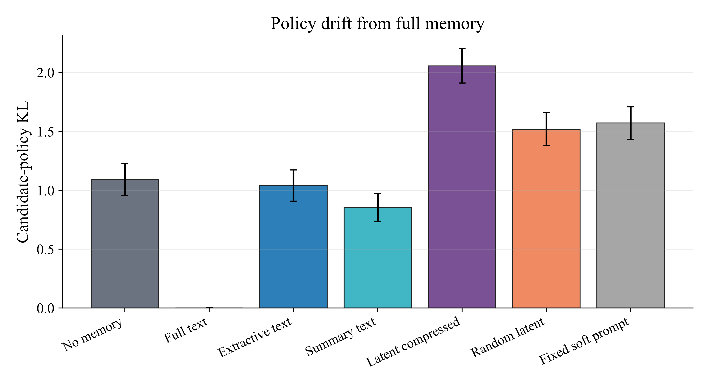
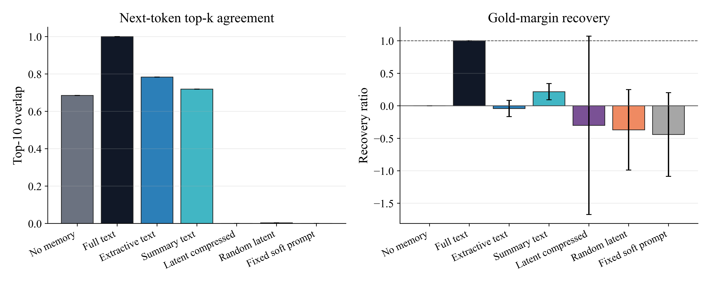
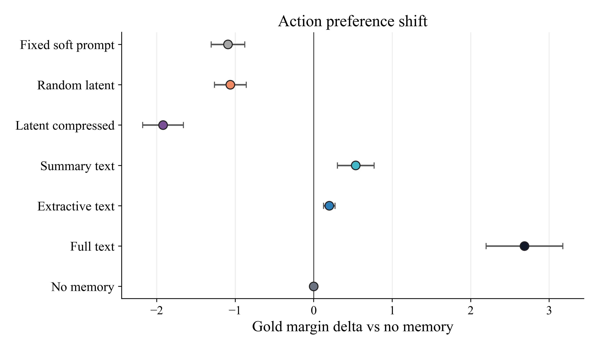
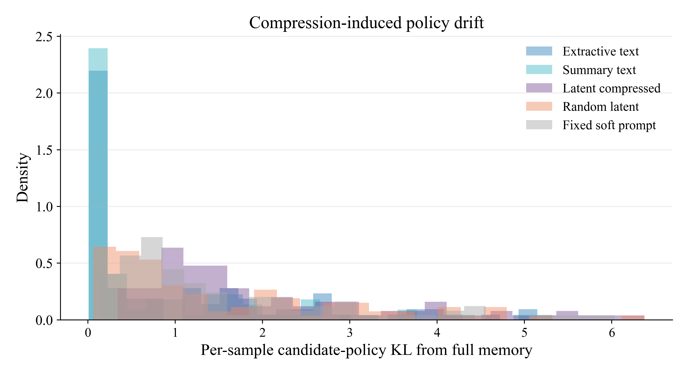

# Memory Compression → Policy Fidelity 实验报告

## 结论

本轮实验按 `docs/experiment_design_v0.1.md` 执行到 M0-M2，共分析 `100` 个样本，数据分布为 `{'gsm8k': 50, 'triviaqa': 50}`。实验固定 base reasoner 参数，只改变同一份 memory `m` 的承载方式，并用 candidate-policy KL、top-k overlap、gold/distractor margin 和 recovery ratio 衡量策略保真。

- 结论 1：压缩确实会改变策略分布。除 `full_text` 自身外，各压缩臂相对 full memory 的 candidate-policy KL 均为非零，因此重建式评价不足以描述策略损失。
- 结论 2：latent 是否优于随机扰动，需要看它是否同时满足更低 full-memory KL、更高 recovery 和更好的 gold margin。当前结果中这三个指标应一起解读，不能只看单一 KL。
- 结论 3：显式压缩与 latent 压缩的差异主要体现在 policy space，而不是最终文本答案。本实验没有运行 Search-R1，也不声称提升在线检索效果。

- 结论 4：`latent_compressed` 的 candidate-policy KL 高于 `random_latent`，差值为 `0.5376`。在当前占位 compressor 下，latent 相对随机 latent 更远 full-memory policy。

## 实验设置

- No memory：只给当前问题，不给 memory。
- Full text：把完整 memory `m` 作为可见文本放入 prompt，作为 policy 上界参照。
- Extractive text：从 `m` 中抽取关键句，并限制到等预算 token。
- Summary text：用同一 base model greedy 生成短摘要并缓存。
- Latent compressed：把 `m` 的 token embeddings 分块 mean-pool 成 MemGen-style latent tokens。
- Random latent：与 latent compressed 范数匹配的随机 latent，对照 soft-token 扰动。
- Fixed soft prompt：冻结的 MemGen soft prompt，对照固定 prefix bias。

## 主要指标

| Setting | Cand. KL full→arm | Top-10 overlap | Gold prob | Margin Δ vs no | Recovery |
|---|---:|---:|---:|---:|---:|
| No memory | 1.0895 | 0.685 | 0.370 | 0.0000 | 0.000 |
| Full text | 0.0000 | 1.000 | 0.721 | 2.6852 | 1.000 |
| Extractive text | 1.0395 | 0.783 | 0.388 | 0.1988 | -0.041 |
| Summary text | 0.8516 | 0.719 | 0.419 | 0.5353 | 0.218 |
| Latent compressed | 2.0561 | 0.000 | 0.111 | -1.9188 | -0.300 |
| Random latent | 1.5185 | 0.003 | 0.204 | -1.0620 | -0.369 |
| Fixed soft prompt | 1.5705 | 0.000 | 0.172 | -1.0920 | -0.442 |

## 图表

## 解释

本实验的对象不是 `π(·|x)` 的自由生成文本，而是固定 candidate action set 上的策略分布。这样做的好处是：同一 `x,m` 下，不同 carrier 的差异可以直接通过 KL、top-k overlap 和 action margin 比较，而不会被生成长度、格式漂移或后续采样噪声混淆。

Full text 是强参照，因为它看到完整 memory；compressed text 和 latent compressed 的问题是保留了多少 full-memory policy effect。Random latent 与 fixed soft prompt 是必要控制：如果它们也接近 full text，说明收益可能来自 soft-token 位置/范数扰动，而不是 memory 内容。

## 限制

- 本轮只完成 M0-M2，不包含 hidden-state mediator Z 的相关性分析，也不包含 activation patching。
- `latent_compressed` 使用 mean-pool embedding compressor，是占位 compressor，不代表最终 MemRAG Composer 能力。
- 当前 memory 是受控 playground memory，包含 answer/policy signal；它用于验证 policy fidelity 度量管线，不等同于在线 RAG evidence path。
- 本实验没有运行 Search-R1，因此不能据此声称多轮检索效果提升。

## 原始文件

- `results/policy_fidelity/m1_text_qwen15.jsonl`
- `results/policy_fidelity/m2_latent_qwen15.jsonl`
